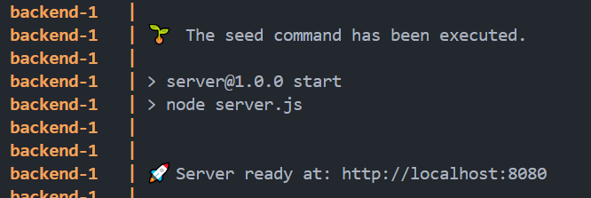
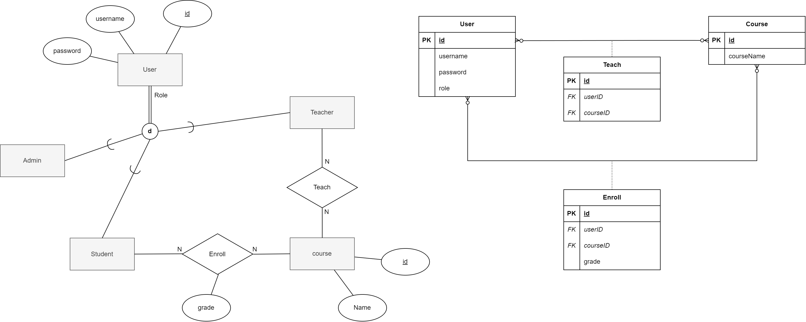
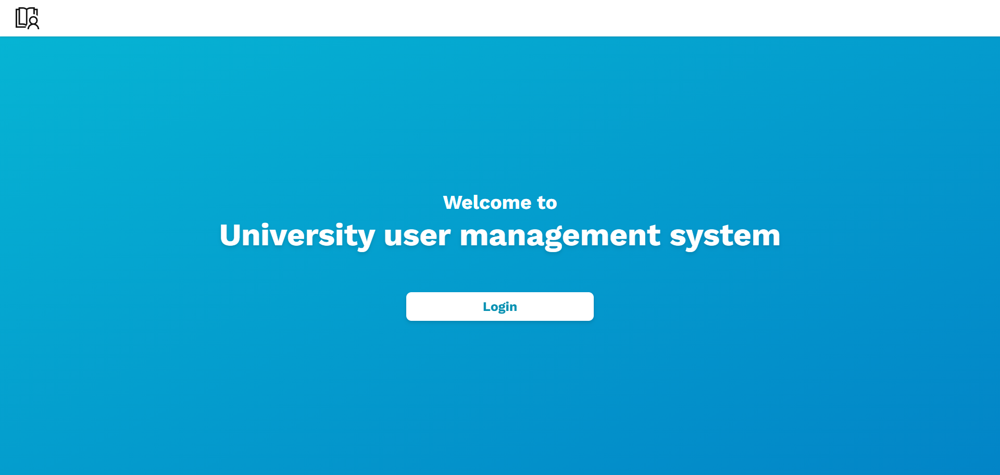
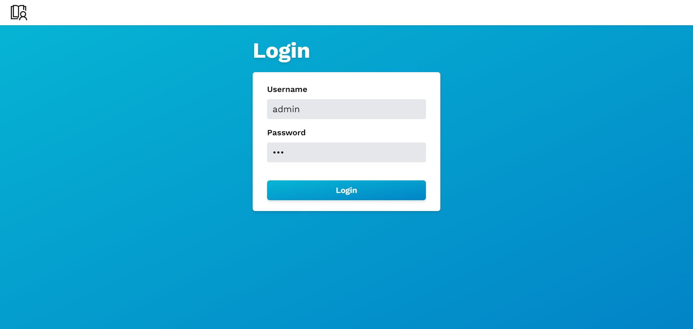
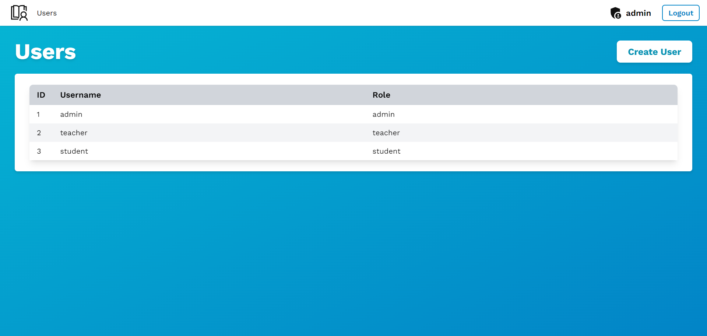
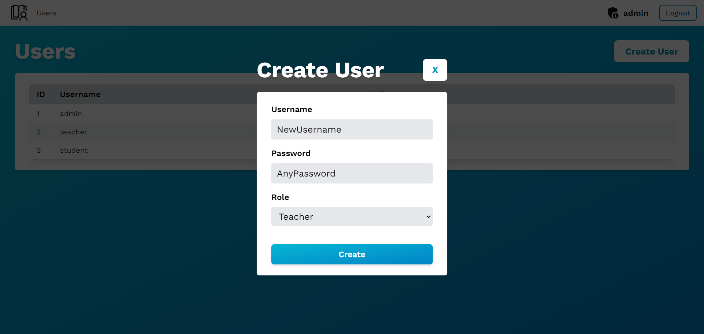
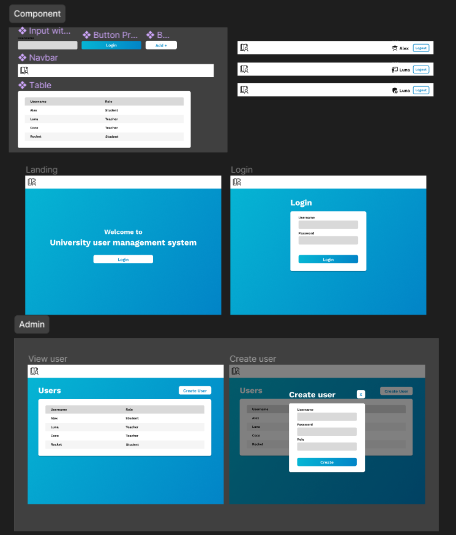

# University User Management System

## Table of Contents

- [Technologies](#technologies)
- [How to run](#how-to-run)
- [ER diagram](#er-diagram)
- [Initial Data](#initial-data)
- [Frontend UI](#frontend-ui)
- [How I developed this project](#how-i-developed-this-project)

## Technologies

**Frontend:** Next.js, TailwindCSS, NextAuth, React-Toastify

**Backend:** Node.js, Express.js, Prisma, Jest, Swagger, Bcryptjs

**Database:** MySQL

## How to run

### 1. Clone repository

1. Run `git clone https://github.com/NonRoute/University-User-Management-System`

### 2. Setup environment variables

1. Navigate to `server` directory
2. Create file named `.env` by copying from `.env.example`
3. Navigate to `client` directory
4. Create file named `.env.local` by copying from `.env.local.example`

### 3A. (Without Docker) Install dependencies

1. Install MySQL Workbench and update the `DATABASE_URL` in the `.env` file inside `server` directory to match with your connection string
2. Change `NEXTAUTH_URL_INTERNAL` in the `.env` file inside `client` directory to `http://localhost:8080`
3. Navigate to `server` directory
4. Run `npm install`
5. Run `npx prisma migrate dev --name init` to setup the database schema
6. Run `npm run dev` to start the server
7. Navigate to `client` directory
8. Run `npm install` and `npm run dev` to start the client

### 3B. (With Docker)

1. Run `docker-compose up`
2. Wait until all services start. Once ready, it should look like this

    

#### Open [http://localhost:3000](http://localhost:3000) to see the frontend

#### Open [http://localhost:8080/api-docs](http://localhost:8080/api-docs) to see the API Document

#### Run `npm run test` in `server` directory to run the unit testing

## ER diagram

    

[View it here](https://drive.google.com/file/d/19vDl3WSHP9oUdTNspMlRitNPFSMRF4kp/view?usp=drive_link)

## Initial Data

Run `npx prisma migrate reset` in `server` directory to reset and seed the database with inital data

Run `npx prisma db seed` in `server` directory to seed the database with inital data

**User**
| Username | Password | Role |
| -------- | -------- | ------- |
| admin | 123 | admin |
| teacher | 123 | teacher |
| teacher2 | 123 | teacher |
| student | 123 | student |
| student2 | 123 | student |

**Course**
| Name |
| -------- |
| Computer Programming |
| Data Structure |
| Algorithm Design |

**Teach**
| Username | Course Name |
|-----------|----------------------|
| teacher | Computer Programming |
| teacher | Data Structure |
| teacher2 | Computer Programming |

**Enroll**
| Username | Course Name | Grade |
|-----------|----------------------|-------|
| student | Computer Programming | A |
| student | Data Structure | |
| student2 | Computer Programming | |

## Frontend UI

Landing page

    

Login page

    

Users page (Admin Access Only)

    

Create user page (Admin Access Only)

    

## How I developed this project

1. Understanding the requirements
2. Choose frontend, backend languages and frameworks and database to use
3. Create ER diagram and database schema
4. Create UI design with Figma
   [View it here](https://www.figma.com/file/zS367p5D0yKj6XfWUvOuNU/University-user-management-system?type=design&node-id=0%3A1&mode=design&t=9R0XcYZzjRc6HTKL-1)

    

5. Design API endpoints and develop backend server
6. Create API document with swagger
7. Develop frontend
8. Create docker compose
9. Create backend unit testing
